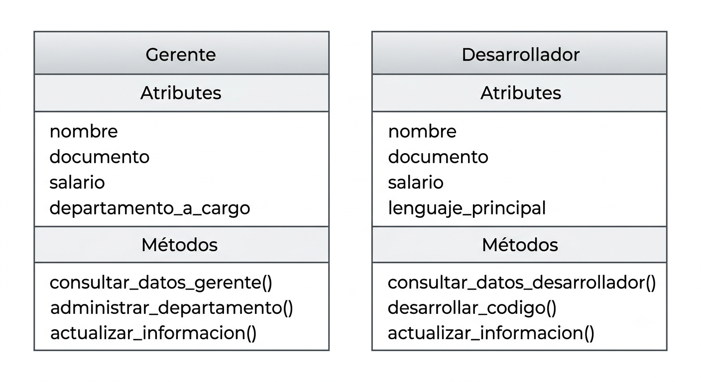
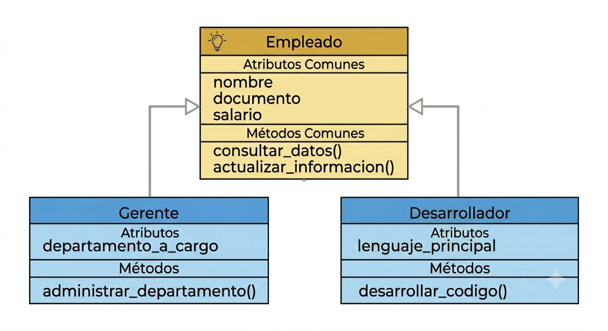

# Situación problema: El caos de no tener Herencia

Imagina que estás desarrollando un sistema para administrar distintos tipos de empleados en una empresa.

Todos los empleados del mundo real poseen información común:

- Nombre
- Documento
- Salario

Sin embargo, también existen roles con características muy particulares:

- **El Gerente** administra un departamento.
- **El Desarrollador** domina un lenguaje de programación específico.

Por tanto, podríamos modelar el sistema creando clases completamente independientes. Veríamos algo así:



Cuando llevemos esta información a código, nos encontraremos con algo como esto:

```python
class Gerente:

    def __init__(self, nombre, documento, salario):
        self.nombre = nombre
        self.documento = documento
        self.salario = salario
        self.departamento = None


class Desarrollador:

    def __init__(self, nombre, documento, salario):
        self.nombre = nombre
        self.documento = documento
        self.salario = salario
        self.lenguaje_programacion = None
```

¿Sería buena idea escribir nuevamente los atributos **nombre**, **documento** y **salario** dentro de cada clase?

La respuesta es **no**.

La Programación Orientada a Objetos propone una solución llamada **Herencia**.


# Herencia: La solución a la duplicación de código
La Herencia es un mecanismo que permite crear nuevas clases basadas en clases existentes. La clase existente se llama **clase padre** o **superclase**, y la nueva clase se llama **clase hija** o **subclase**. Veamos la anterior situación con Herencia:



Si lo llevamos a código, el resultado sería el siguiente:

```python
class Empleado:

    def __init__(self, nombre, documento, salario):
        self.nombre = nombre
        self.documento = documento
        self.salario = salario

class Gerente(Empleado):

    def __init__(self, nombre, documento, salario, departamento):
        super().__init__(nombre, documento, salario)
        self.departamento = departamento

class Desarrollador(Empleado):

    def __init__(self, nombre, documento, salario, lenguaje_programacion):
        super().__init__(nombre, documento, salario)
        self.lenguaje_programacion = lenguaje_programacion
```
En este caso, hemos creado una clase padre llamada `Empleado` que contiene los atributos comunes a todos los empleados. Luego, las clases `Gerente` y `Desarrollador` heredan de `Empleado`, lo que les permite reutilizar el código y evitar la duplicación.

# Sintaxis de la Herencia
La sintaxis es sencilla.

```python
class ClaseHija(ClasePadre):
    # Código de la clase hija
```

# Heredando el constructor
Cuando una clase hija hereda de una clase padre, no solo hereda los atributos y métodos, sino también el constructor. Por ejemplo:
```python
class Empleado:
    def __init__(self, nombre):
        self.nombre = nombre    

class Gerente(Empleado):
    pass
```
Creamos un objeto:
```python
    gerente = Gerente("Juan")
    print(gerente.nombre)  # Output: Juan
```
# Agregando nuevos atributos

Una clase hija también puede tener información adicional:
Ejemplo:
```python
 class Empleado:
    def __init__(self, nombre):
        self.nombre = nombre
```
Ahora la clase hija tendrá un atributo adicional:
```python
class Diseñador(Empleado):
    def __init__(self, nombre, herramienta):
        super().__init__(nombre)
        self.herramienta_diseño = herramienta
```
## Ejemplo completo:
```python
    class Empleado:

        def __init__(self, nombre):
            self.nombre = nombre


    class Diseñador(Empleado):

        def __init__(self, nombre, herramienta):

            super().__init__(nombre)

            self.herramienta = herramienta


    persona = Diseñador("Laura", "Figma")

    print(persona.nombre)
    print(persona.herramienta)
```
Salida:
```
Laura
Figma
```
# Heredando métodos
La herencia no solo reutiliza atributos.

También reutiliza métodos.
```python
class Persona:

    def saludar(self):
        print("Hola.")
```
```python
class Profesor(Persona):
    pass
```
```python
docente = Profesor()

docente.saludar()
```
Salida:
```
Hola.
```
